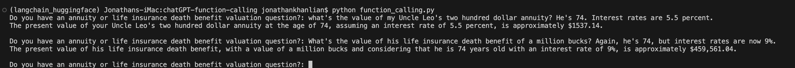

This is a Large Language Model with function calling experiment. There are two actuarial functions that are defined that the language model has access to and can call to compute an answer. The ChatGPT language model (accessed via an API) extracts the arguments/parameters needed to call one of the available functions from a natural language prompt, get's the computed results, and then puts those numbers into a natural language response. This is done in a few steps including two api calls.

Note: There is no error handling so you will be able to break it with the right kind of prompt.

To use this code, you'll need to create a .env file and put a chat gpt OPENAI_API_KEY in it.

